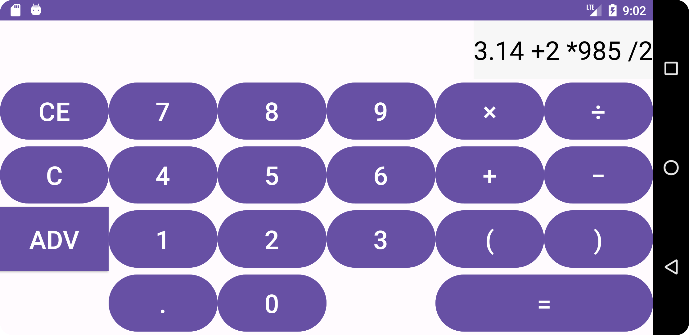
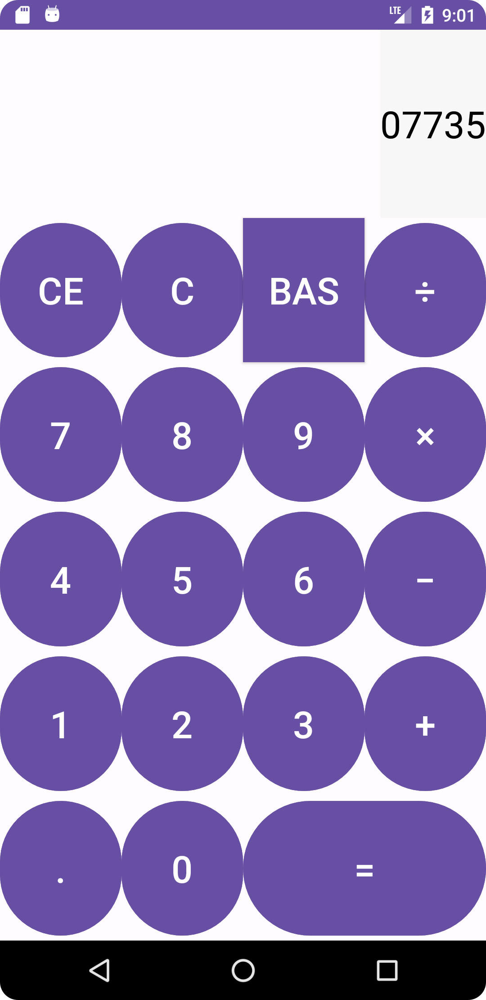

On startup the calculator is in “<b>BAS</b>” or basic mode. Clicking on “<b>BAS</b>” will change the mode to
“<b>ADV</b>” or advanced. This works in the opposite way as well.  
Entering the sequence: on basic mode:  
10  
+5*  
-> 15  
2  
= 30  
Entering the sequence: on advanced mode:  
10+5*2 = 20  
Entering the sequence: on basic and advanced mode  
10/0 = Error  
Entering the sequence: in advanced mode  
10**6 = Error (as there are to many operators)  
Entering the sequence: in advanced mode  
5-(6+(5) = Error (as there are too many open brackets)  

